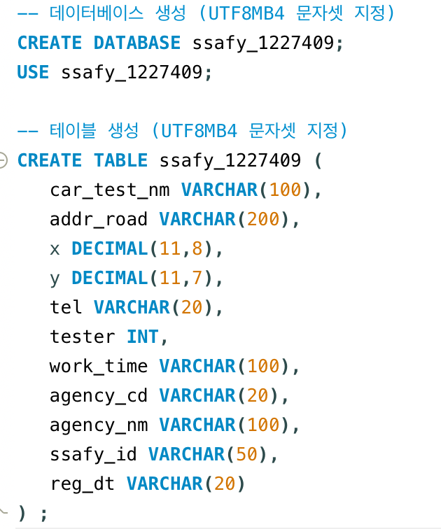
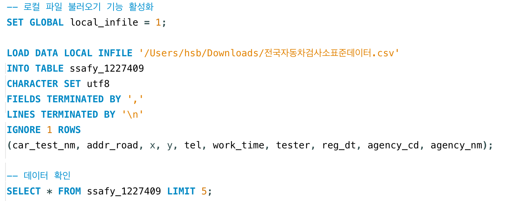
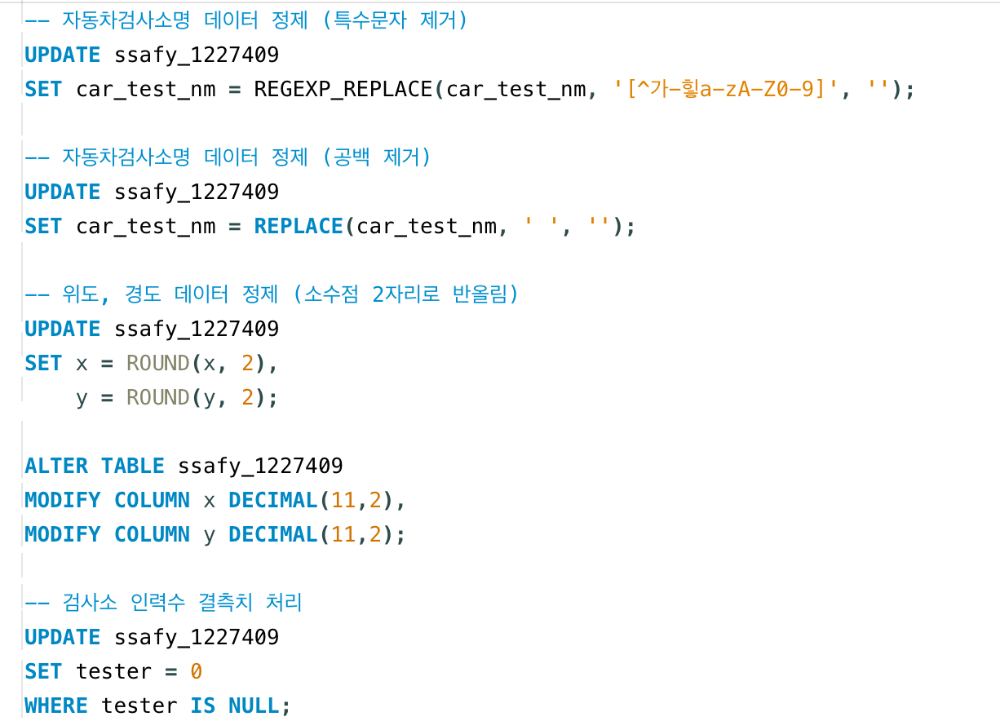
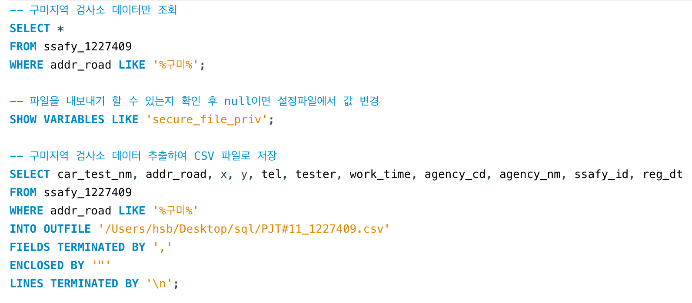
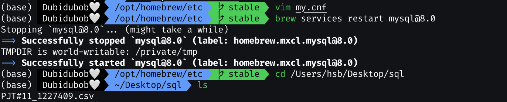

## PJT#11: MySQL 데이터 전처리

### 📋 학습 목표

- 전국자동차검사소표준데이터.csv 파일을 다운 받아 필요한 데이터들을 정제하고 전처리 하는 과정 학습
   

---

#### 1. 명세서를 기반으로 테이블 생성

#### 2. 해당 csv 파일 가져오기

#### 3. 데이터 전처리

- 자동차 검사소명 필드의 텍스트 데이터 중 특수문자 제거
- 자동차 검사솜녕 필드의 텍스트 데이터 중 공백 제거
- 경도 필드값을 소수점 2자리까지만 남도록 가공
- 검사소 인력수 값이 없는 경우 결측치 처리

#### 4. 구미 검사소만 추출하여 CSV 파일로 추출

---

### ⭐️ 이슈

CSV 파일을 불러오는 과정에서 secure_file_priv이 null로 설정되어 있는 바람에 파일을 내보낼 수 없었었다.

필자는 my.cnf 설정파일을 찾아 /Users/hsb/Desktop/sql 에 내보내기가 될 수 있도록 값을 수정함으로써 해결할 수 있었다.

