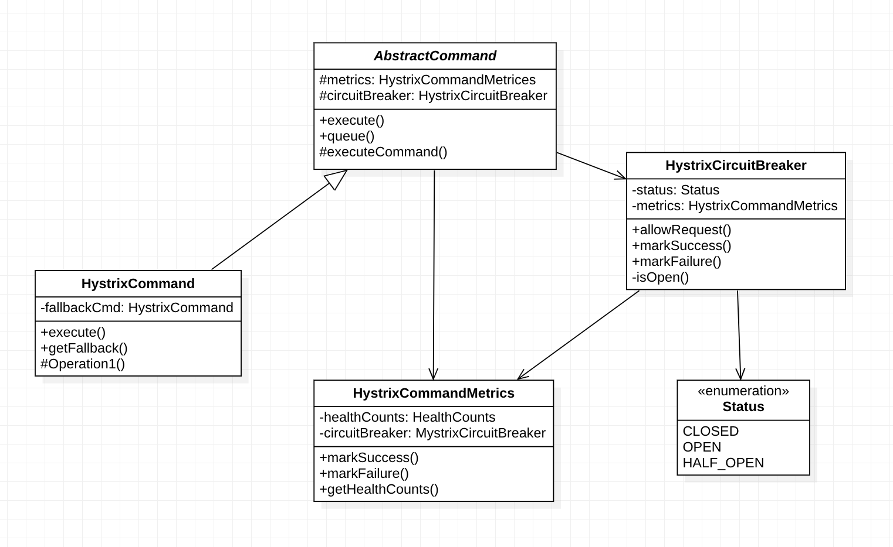

## PJT#17: UML을 활용한 오픈 소스 분석

### 📋 학습 목표

- UML(Unified Modeling Language)을 활용해 오픈 소스 코드를 분석
- 코드를 읽고 분석하는 능력 함양

---

#### 1. 오픈 소스

Naver의 대표적인 오픈소스 프로젝트인 Spring Cloud for Netflix OSS를 분석해보았다. Circuit Breaker 패턴을 구현한 부분을 선택했다.
<br>
[Spring Cloud for Netflix OSS 깃허브 링크](https://github.com/Netflix/Hystrix/tree/master/hystrix-core/src/main/java/com/netflix/hystrix)

#### 2. 'Circuit Breaker' 패턴

'Circuit Breaker' 패턴이란 다른 어떠한 서비스가 터졌을 때 전체 서비스가 먹통이 되지 않도록 방지해주는 패턴이다.
<br>
UML을 그리기 전에, 코드를 조금 분석해 보았다.
<br>

핵심 파일은 3개 인 것 같다.

- HystrixCircuitBreaker.java

- HystrixCommand.java

- HystrixCommandMetrics.java

#### 3. UML 분석

명세서를 참고하면, 객체의 책임, 객체간 관계, 수명 관리 등 정적인 부분을 분석하고 싶으면 class diagram이 적합하고 어떤 함수를 호출했을 때 어떤 일이 일어나는 지가 궁금하다면 sequence diagram이 적절하다고 한다.
<br>
나의 경우 전체적인 구조와 실제로 어떻게 동작하는지 알아야 할 것 같아서 둘 다 그려보았다.
<br>

- Class Diagram



AbstractCommand가 HystrixCommandMetrics와 HystrixCircuitBreaker를 가지고 있고
HystrixCommand가 AbstractCommand를 상속받으며
HystrixCircuitBreaker가 Status(enum)과 HystrixCommandMetrics를 가지고 있는 구조이다.

- Sequence Diagram


```
1. Client가 execute() 실행

2. [Circuit is CLOSED] 상황일 때
    2.1. HystrixCommand가 CircuitBreaker에게 allowRequest()로 요청 허용 여부를 확인
    2.2. CircuitBreaker는 HystrixCommandMetrics에게 getHealthCounts()로 현재 상태 정보를 요청
    2.3. Metrics가 상태 정보(counts)를 반환
    2.4. CircuitBreaker가 HystrixCommand에게 true를 반환
    2.5. HystrixCommand가 executeCommand()를 실행
    2.6. [Command fails] 명령 실패 시
        2.6.1. HystrixCommand가 Metrics에 markFailure()로 실패를 기록
        2.6.2. Metrics가 CircuitBreaker에게도 markFailure()로 실패를 알림
    2.7. [Failure threshold exceeded] 실패 임계치 초과 시
        2.7.1. CircuitBreaker가 moveToOpen()을 호출하여 상태를 OPEN으로 변경
        2.7.2 HystrixCommand는 getFallback()을 호출하여 대체 로직 실행

3. [Circuit is OPEN] 상황일 때
    3.1. HystrixCommand가 CircuitBreaker에게 allowRequest() 호출
    3.2. CircuitBreaker가 false를 반환
    3.3. HystrixCommand는 바로 getFallback() 호출하여 대체 로직 실행

4. Client에게 실행 결과를 return result로 반환
```

---

### ⭐️ 이슈

이슈는 'CircuitBreaker'를 왜 쓰는지 궁금했다.

연쇄 실패 방지를 위해 쓴다고 한다.

결제 서비스 → 주문 서비스 → 배송 서비스

- Circuit Breaker 없다면

1. 결제 서비스 과부하
2. 주문 서비스도 응답 지연
3. 배송 서비스도 영향
4. 전체 시스템 마비

- Circuit Breaker 있다면

1. 결제 서비스 과부하 감지
2. Circuit OPEN
3. 빠른 실패 처리 (Fast Fail)
4. 다른 서비스는 정상 운영
