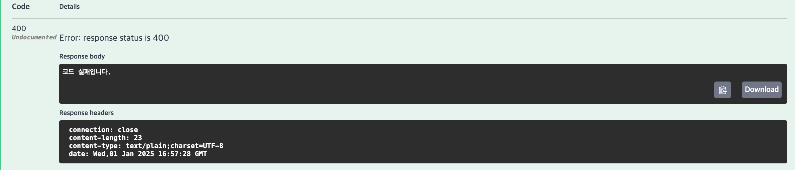

## PJT#19: 코딩 테스트 채점 서버 만들기

### 📋 학습 목표

- API 서버를 구축하는 방법 습득
- 기본적인 REST 통신 사용
- 반드시 레퍼런스 문서를 통해서 학습

---

#### 채점할 문제

[보호필름](https://swexpertacademy.com/main/code/problem/problemDetail.do?contestProbId=AV5V1SYKAaUDFAWu)

---

### 결과

1. 올바른 코드 입력 시


2. 올바르지 않은 코드 입력 시



3. 문법 오류 코드 입력 시


---

### ⭐️ 이슈

javac를 실행하기 위해 ProcessBuilder를 사용하는 과정에서 JDK와 JRE에 대한 개념이 헷갈려 정리하고자 한다.

#### 1. IntelliJ

- IDE(통합 개발 환경)
- JDK(javac 포함)와 JRE 모두 사용

우리가 코드를 작성하고 실행할 때 Run 버튼을 클릭하면 IntelliJ가 내부적으로 javac 실행해서 컴파일한 후에 JRE로 실행을 한다.

#### 2. JDK (Java Development Kit)

- 말 그대로 개발 도구임
- Javac, Jar 같은 애들이 존재

#### 3. JRE (Java Runtime Environment)

- 실행할 때 쓰이는 라이브러리 (java.lang, java.util) 존재
- StringBuilder나 ProcessBuilder 같은 애들이 존재

#### 4. Spring Boot

- 자바 기반의 웹 프레임워크(웹 애플리케이션을 만들기 위한 기본 구조와 도구를 제공하는 것)
- JDK 위에서 돌아감

src/main/java 폴더 안에 있는 .java 파일들을 JDK의 javac가 컴파일해서 .class 파일로 만들고 만들어진 .class 파일들은 JRE 위에서 실행된다.

```java
Spring Boot Project
├── src
│   ├── main
│   │   ├── java (우리가 작성하는 .java 파일들이 여기에!)
│   │   │   └── com.example.project
│   │   │       ├── controller
│   │   │       ├── service
│   │   │       ├── repository
│   │   │       └── domain
│   │   └── resources
│   │       ├── static (CSS, JS, 이미지 등)
│   │       ├── templates (HTML 파일들)
│   │       └── application.properties/yml
│   │
│   └── test  (테스트 코드 작성)
│       └── java
│
├── JDK (개발 도구)
├── JRE (실행 환경)
└──── JVM (Java Virtual Machine)
└── pom.xml/build.gradle (의존성 관리)
```

.java 를 .class로 왜 컴파일을 해줘야 하나 궁금했다.

자바의 가장 중요한 특징!

"Write Once, Run Anywhere" (한번 작성하면 어디서든 실행 가능)라는 철학을 지키기 위해서이다.

같은 자바 코드를 .class 로 컴파일을 하면 java가 설치되지 않아도 모든 운영체제(윈도우, 리눅스 , 맥)에서 실행 가능하다.

.class 파일은 우리가 생각하는 2진수로 변환된 파일이기 때문에 모든 운영체제에서 다 읽을 수 있는 것이다.

- Python의 경우

hello.py -> 바로 실행 (하지만 Python이 설치된 환경만 가능)

- C++의 경우

hello.cpp -> hello.exe (Windows용)

hello.cpp -> hello.out (Linux용)

#### 5. JVM (Java Virtual Machine)

- .class 파일을 각 OS에 맞는 기계어로 바꿔주는 프로그램

```java
// 1. 소스코드
public class Hello {
    public static void main(String[] args) {
        int a = 1;
        int b = 2;
        System.out.println(a + b);
    }
}

// 2. 바이트코드(.class) - 2진수
CA FE BA BE ... (JVM이 이해할 수 있는 형태)

// 3. 기계어 - OS별로 다름
Windows: 10110101...
Mac: 11100010...
Linux: 10001101...
```

#### ProcessBuilder

- JDK에 있는 javac를 수동으로 실행하게 해주는 도구

가끔 우리가 코드 상에서 어떠한 파일을 컴파일 하고 싶다면 ProcessBuilder로 javac를 사용할 수 있는데, 마치 수동으로 cmd 창에서 javac Test.java를 치는 것과 똑같다.

```
// 우리가 직접 javac를 실행하고 싶을 때
ProcessBuilder pb = new ProcessBuilder("javac", "Test.java");
```

#### OutputStreamWriter

PJT19_input.txt에서 받아온 파일을 사용자가 입력한 소스 코드(process)의 입력으로 넣고싶을 때 아래와 같은 코드를 작성할 수 있다.

```java
try (BufferedWriter writer = new BufferedWriter(new OutputStreamWriter(process.getOutputStream()))) {
    String line;
    while ((line = inputBr.readLine()) != null) {
        writer.write(line);
        writer.newLine();
    }
    writer.flush();
}
```

- process.getOutputStream() : 프로세스에 데이터를 쓸 수 있는 스트림 (프로세스의 입력)
- process.getInputStream() : 프로세스로부터 데이터를 읽을 수 있는 스트림 (프로세스의 출력)

input.txt의 내용이 "Hello\nWorld"라면 inputBr.readLine()으로 "Hello", "World" 순서로 읽고
writer를 통해 프로세스에 전달하면 실행중인 Java 프로그램에서 Scanner나 BufferedReader로 이 입력을 받을 수 있다.
