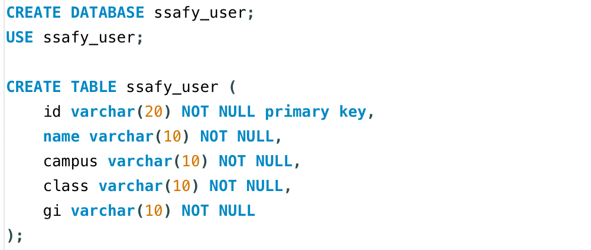
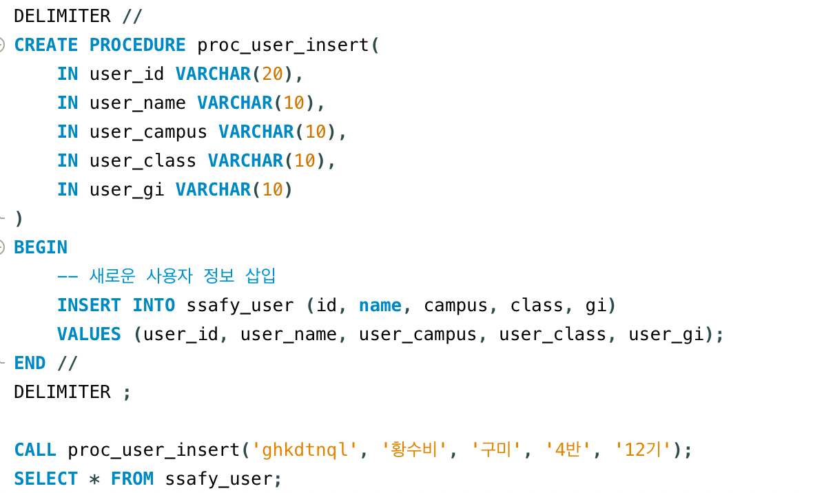
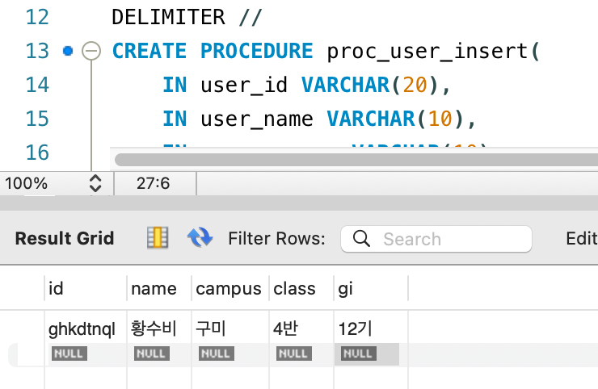

## PJT#1: MySQL 저장 프로시저 실습

### 📋 학습 목표

- 데이터베이스에 저장 프로시저를 생성하고 실행하는 방법 학습
- 입력 변수를 활용한 저장 프로시저 실행 및 결과 확인
- SELECT 문을 통한 데이터 입력 검증
   

---

#### 1. 실습용 테이블 신규 생성

#### 2. 저장 프로시저 작성

#### 3. 실행 결과

