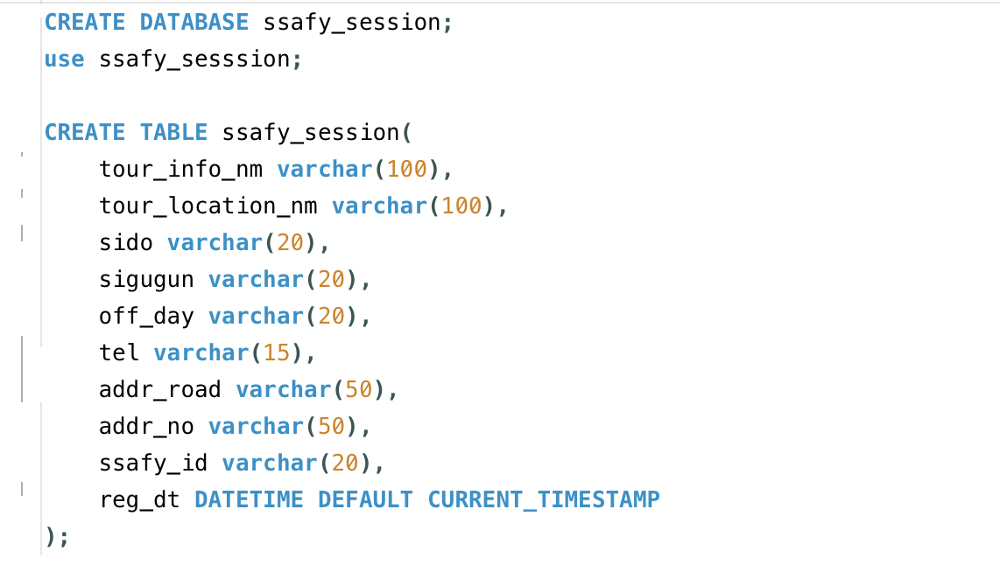
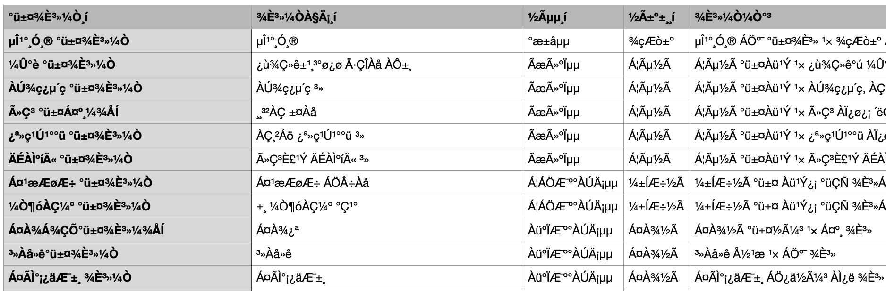

## PJT#27: MySQL data processing

### 📋 학습 목표

- 전국관광안내소표준데이터.csv 파일을 다운 받아 필요한 데이터들을 정제하고 전처리 하는 과정 학습
   

---

#### 1. 명세서를 기반으로 테이블 생성

#### 2. CSV 파일 가져온 후 전처리

#### 3. 결과 확인

---

### ⭐️ 이슈

csv 파일을 UTF-8 형식으로 가져오기 했을 때, 이상한 문자들로 출력이 되었다.
 
EUR_KR 형식 등 다양하게 변환을 해봐도 똑같이 이상한 문자들로 출력이 되었다.
 
xls 파일로 다운받았더니 UTF-8 형식으로 가져올 수 있어서 xls 파일을 csv 파일로 변환해서 sql로 가져왔다.
 
csv 파일이 인코딩 오류가 난 이유를 추측해보자면 파일에 손상이 있어서가 아닐까?

