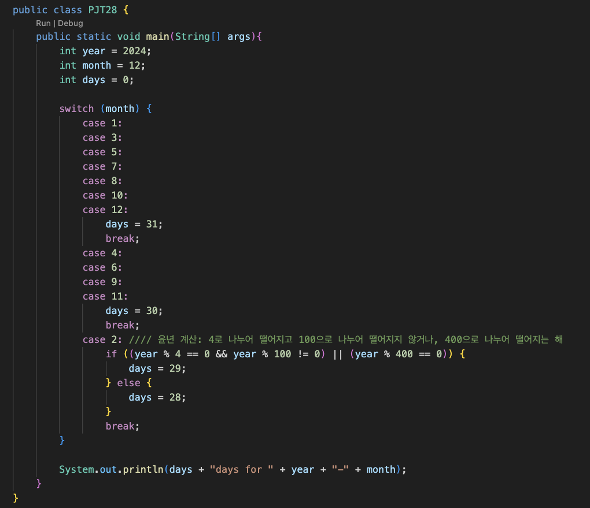

## PJT#28: Collection

### 📋 학습 목표

- 소스 코드에서 비교 연산 후 결정되는 동작이 동일한 패턴일 경우 컬렉션(Collection)을 활용하여 코드 개선
- switch 코드 대신, 컬렉션을 사용하는 방식으로 코드 작성

   

---

#### 1. 현재 달의 날수를 출력하는 코드 (api 미사용)

- 컬렉션 사용전
  

- 컬렉션 사용후
  

---

### ⭐️ 이슈

vscode에서 classNotFound 오류가 발생했는데, 해당 클래스의 위치를 제대로 찾지 못해서 발생했다.
 
extension애서 아래 녀석을 깔아줌으로써 해결했다.

