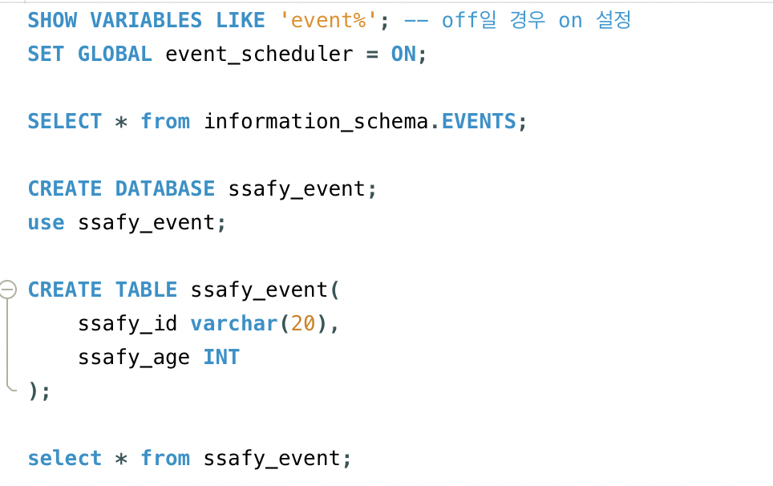

## PJT#7: MySQL Event Scheduler

### 📋 학습 목표

- 주기적으로 또는 특정 일시에 작업이 자동으로 발생해야 하는 경우, MySQL Event를 통해 작업이 실행되도록 실습

   

---

#### 1. Event Scheduler 생성 전 확인 사항

#### 2. Event Scheduler 구문

- 1분마다 데이터가 등록되는 Event Scheduler 작성 (데이터가 20개가 되면 이벤트 중지)
  

- 현재 시각으로부터 5분 후 모든 데이터를 삭제하는 Event Scheduler 작성
  

- 특정 기간 동안만 반복 실행되는 Event Scheduler 작성
  

#### 3. 실행 결과

5분 후 테이블 상태 (데이터가 삭제되어 있다.)

---

### ⭐️ 이슈

이슈 없음.
