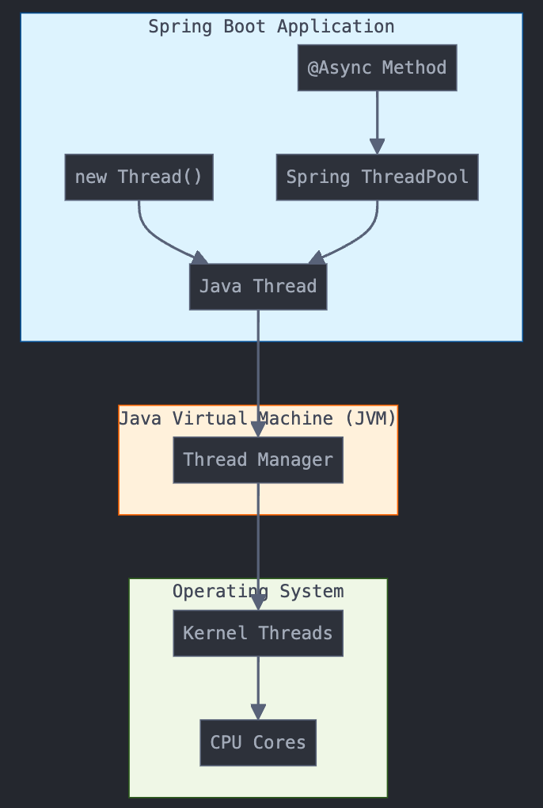

먼저, 운영체제의 프로세스, 스레드를 알아야 하는 이유에 대해 정리해보고자 한다.

일반적으로 개발자가 프로그래밍 언어를 이용해서 원하는 작업의 모음을 기술한 이후 컴파일 과정을 거쳐 운영체제에게 이것을 실행하도록 명령을 내리면 '프로세스'를 생성하여 관리하게 된다.

내가 작성한 프로그램이 어떤 상태에 있는지 모니터링 하기 위해서라도 이에 대한 이해는 필수라고 할 수 있다.

하나의 프로세스가 수행되는 동안에도 여러 개의 하위 작업들을 동시에 수행해야만 하는 경우가 존재한다.

예를 들어 동영상 플레이어를 직접 만들어야 하는 경우 영상과 사운드 두 가지 자료를 동시에 디코딩해야 하는 과정이 필연적으로 요구되는데 이럴 때에 스레드를 활용한 적절하 자원 스케줄링을 통해 사람이 느끼기에는 동시에 해당 작업들이 이루어지는 듯한 효과를 낼 수 있다.

### 프로세스(process)란 ?

프로세스는 독립된 메모리 공간을 항당받는다.

- Code: 실행할 프로그램의 코드

- Data: 전역 변수, 정적 변수

- Heap: 동적 할당 메모리 영역

- Stack: 지역 변수, 함수 호출 정보

### 스레드(thread)란 ?

스레드는 어떠한 프로그램 네에서, 특히 프로세스 내에서 실행되는 흐름의 단위를 말한다.

일반적으로 한 프로그램은 하나의 스레드를 가지고 있지만, 프로그램 환경애 따라 둘 이상의 스레드를 동시에 실행할 수 있다.

이러한 실행 방식을 멀티스레드(multi thread)라고 한다.

### 프로세스와 스레드의 차이점은 ?

프로세스 A : [Code,Data,Heap,Stack] (완전히 독립)  
프로세스 B : [Code,Data,Heap,Stack] (완전히 독립)

프로세스 내 스레드들

Thread 1 [Stack]  
Thread 2 [Stack] -> [공유된 Code,Data,Heap 영역]
Thread 3 [Stack]

### 스레드의 종류 ?

사용자 레벨 스레드와 커널 레벨 스레드가 존재한다.

우리가 코드로 작성하는 것은 모두 사용자 레벨 스레드를 다루고 있는 것이먀, @Async 어노테이션을 통해 스레드를 다루게 되면 JVM이 커널 레벨 스레드와 연결한다.

보통, 스레드를 작업마다 새로 만들면 관리가 어렵기 때문에, @Async로 프레임워크가 관리하도록 하고 우리는 connection poll 만 조정한다.



### 백엔드 개발자는 스레드와 프로세스를 어떻게 다루는 가?

대부분 Spring Framework가 내부적으로 처리해주지만, 적절한 설정과 사용법을 이해하고 있어야 한다.

1. @Async를 활용한 비동기 처리

- 대량 메일 발송, 푸시 알림 등 시간이 걸리는 작업을 비동기로 처리
- 사용자 응답은 빠르게 반환하고, 백그라운드에서 처리

```java
@Service
public class EmailService {

    @Async
    public CompletableFuture<Void> sendBulkEmails(List<String> recipients) {
        // 별도 스레드에서 대량 이메일 발송
        return CompletableFuture.runAsync(() -> {
            recipients.forEach(this::sendEmail);
        });
    }
}
```

2. ThreadPool 설정

- 동시 처리할 작업량에 따라 스레드풀 크기 조정
- 서버 사양과 작업 특성을 고려해서 설정

```java
@Configuration
public class AsyncConfig implements AsyncConfigurer {

    @Override
    public Executor getAsyncExecutor() {
        ThreadPoolTaskExecutor executor = new ThreadPoolTaskExecutor();
        executor.setCorePoolSize(5);         // 기본 스레드 수
        executor.setMaxPoolSize(30);         // 최대 스레드 수
        executor.setQueueCapacity(100);      // 대기 큐 크기
        executor.setThreadNamePrefix("async-");
        executor.initialize();
        return executor;
    }
}
```

3. JPA와 트랜잭션 관리

- 각 트랜잭션은 별도의 스레드로 처리될 수 있음
- @Transactional의 격리 수준(isolation level) 설정으로 동시성 제어

```java
@Service
@Transactional
public class OrderService {

    @Autowired
    private OrderRepository orderRepository;

    public void processOrder(Order order) {
        // 각 트랜잭션은 별도의 스레드에서 독립적으로 동작
        orderRepository.save(order);
    }
}
```

4. 배치 처리

- 정기적인 데이터 정리, 통계 집계 등
- 스케줄러가 별도 스레드로 관리

```java
@Component
@EnableScheduling
public class DataCleanupJob {

    @Scheduled(cron = "0 0 2 * * *")  // 매일 새벽 2시
    public void cleanupOldData() {
        // 별도 스레드에서 실행되는 정기적인 청소 작업
    }
}
```

5. 동시성 이슈 처리

- 동시에 여러 사용자가 같은 데이터를 수정하는 경우
- 락을 통한 동시성 제어

```java
@Service
public class StockService {

    @Lock(LockModeType.PESSIMISTIC_WRITE)
    @Transactional
    public void decreaseStock(Long productId, int quantity) {
        Product product = productRepository.findById(productId);
        product.decreaseStock(quantity);
    }
}
```

---

### ⭐️ 이슈

정리하면서 대용량 트래픽 경험을 통해 스레드 관리를 해보고 싶다는 생각이 들었다.
